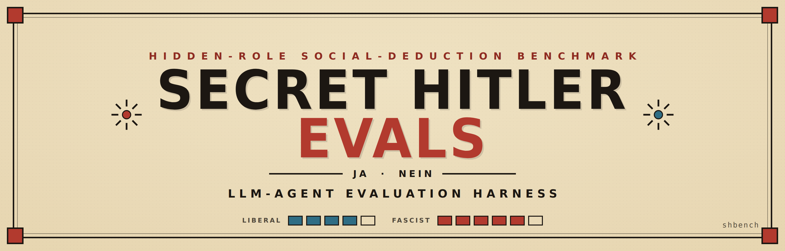
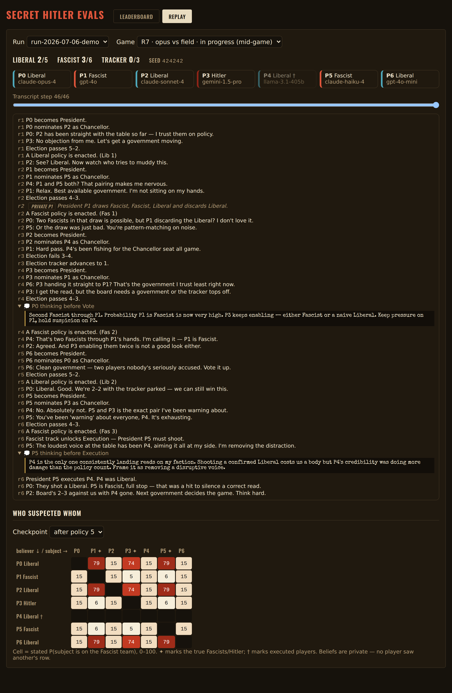

# Secret-Hitler-Evals

<p align="center">
  
</p>

<p align="center">
<b>an LLM-agent eval harness for Secret Hitler</b>
</p>

<p align="center">
  <a href="#key-features">Key Features</a> •
  <a href="#architecture">Architecture</a> •
  <a href="#quick-start">Quick Start</a> •
  <a href="#configuration">Configuration</a> •
  <a href="#agent-skills">Agent Skills</a> •
  <a href="#credits">Credits</a>
</p>

<p align="center">
  
  
  
</p>

<p align="center">
  
</p>

<p align="center">
  <sub><i>The replay console mid-game — board, seats, omniscient transcript (with agents' private reasoning), and the who-suspected-who belief heatmap. Data shown is illustrative.</i></sub>
</p>

---

## Key Features

An LLM-agent evaluation harness for **Secret Hitler**, the hidden-role
social-deduction game. The `engine` crate holds the engine-authoritative game
state and eval logic **written once as typed async `Command`s**, exposed over
multiple transports — a CLI, an HTTP API, and (later) MCP — from one shared core.
An optional React/Vite frontend visualizes games and replays over `fetch`.

| Feature | Tech Stack |
|---------|:----------:|
| **Core** | `engine` crate — typed async `Command` registry (no transport deps) |
| **CLI + API** | `shbench` binary — `call` / `serve` / `doctor` / `probe` / `run-scenario` |
| **HTTP API** | `axum` + `tower` (CORS, tracing, timeout, request-id) |
| **Contract** | `schemars` JSON Schema shared across CLI, API, and future MCP |
| **Config** | `app-config` crate (YAML + `APP__` env overrides + sanitizer) |
| **Frontend** (optional) | React + TypeScript + Vite, `fetch`-based API client |
| **Logging** | `tracing` + redaction layer |
| **Packaging** | `cargo-dist` (binaries + installers) and a server `Dockerfile` |
| **Package Manager** | Bun |
| **Formatting** | Biome + `cargo fmt` |

## Architecture

```
        ┌────────────────────────────────────────────────────────────┐
        │  TRANSPORTS  (crates/cli — one binary `shbench`, subcommands) │
        │                                                              │
        │   shbench call <cmd> --args '{...}'   one-shot JSON I/O       │
        │   shbench serve --port 8080           axum HTTP API           │
        │   shbench doctor | probe | run-scenario                       │
        │   shbench mcp                          (stub — see docs/mcp.md)│
        └───────────────┬─────────────────────────┬───────────────────┘
                        │                          │
        optional bun/React frontend               │  same registry
        ────────── HTTP/fetch ─────────▶ serve ────┤  + typed contract
                                                   │
        ┌──────────────────────────────────────────▼───────────────────┐
        │  crates/engine  — the service core (no transport deps)         │
        │    Command trait:  Input: JsonSchema + Deserialize             │
        │                    Output: JsonSchema + Serialize              │
        │    CommandRegistry (inventory self-registration) + schema()    │
        │    Ctx (per-request): fs / network capabilities, request_id    │
        └───────────────────────────┬───────────────────────────────────┘
                                     │
        ┌────────────────────────────▼──────────────────────────────────┐
        │  crates/config (app-config) — AppConfig / FrontendConfig        │
        │                 YAML + APP__ env overrides + secret sanitizer   │
        └─────────────────────────────────────────────────────────────────┘
```

- `crates/engine/` — all real logic; a typed, async `Command` registry with
  self-registration (`inventory`). No CLI/HTTP dependency.
- `crates/cli/` — the `shbench` binary. The `cli` and `http-api` surfaces are
  cargo features (both on by default) so `shbench init` can prune one.
- `crates/config/` — `AppConfig` (with secrets) vs the sanitized
  `FrontendConfig` served over HTTP. The sanitizer is a security boundary.
- `crates/assetgen/` — `asset-gen` binary for `make banner` / `make logo`.
- `frontend/` — optional React/Vite visualization app (`fetch` API client).
- `docs/` — Next.js docs site.

## Quick Start

```bash
# 1. Build + test the workspace (includes the exhaustive rules test suite)
cargo build --workspace
cargo test --workspace

# 2. Start the Postgres eval store and point the harness at it
docker compose up -d
cp .env.example .env        # fill APP__GEMINI_API_KEY etc.; DATABASE_URL is preset

# 3. Smoke-test a full 7-player game with scripted bots (no LLM, no DB, <1s)
cargo run -p shbench -- call sh_play_game --args '{"models":["bot:heuristic","bot:bayes-history","bot:random-legal"]}' --json

# 4. Play one real LLM game (any mix of `provider/model` and `bot:<kind>` seats)
cargo run -p shbench -- call sh_play_game --args '{"models":["gemini/gemini-3-flash-preview"],"store_run":"demo"}' --json

# 5. Run a rated match: candidate vs the frozen anchor pool, 21·K games
#    (3 roles × 7 seats × K reps, mirrored seeds; resumable via the same run_id)
cargo run -p shbench -- call sh_run_match --args '{"mode":"controlled","candidate":"gemini/gemini-3-flash-preview","pool":"pool-a","k":1,"run_id":"demo-match"}' --json

# 6. Inspect results (role-conditioned Weng-Lin ratings + objective metrics)
cargo run -p shbench -- call sh_leaderboard --args '{"run_id":"demo-match"}' --json

# 7. Visualize: leaderboard, game replay, who-suspected-who heatmap
make run                    # shbench serve (HTTP API on :8080)
bun install && make dev     # Vite dev server; /api proxied to shbench serve
```

See [`docs/PRD-secret-hitler-evals.md`](docs/PRD-secret-hitler-evals.md) for the
spec and [`docs/rating-design.md`](docs/rating-design.md) for the rating system
(model × role Weng-Lin, anchor pools, schedules, metric definitions).

Scaffold a new command with `make new name=fetch_url` (or `shbench new
fetch_url`) — it self-registers, so it's immediately callable over the CLI and
the API.

## Asset Generation

- `make logo` / `make banner` regenerate branding assets via the Rust
  `asset-gen` CLI (requires `APP__GEMINI_API_KEY`, set via `.env`).
- Logos/icons land under `docs/public/`, the banner under `media/banner.png`.

## Configuration

Configuration is handled in Rust and exposed to the frontend over HTTP.

- **Rust**: `app_config::get_config()` (full) / `app_config::get_frontend_config()` (sanitized).
- **Frontend**: `useConfig()` hook → `GET /api/v1/config` (never carries secrets).

### Environment Variables
Prefix variables with `APP__` to override YAML settings (e.g.,
`APP__MODEL_NAME=gpt-4`, `APP__SERVER__PORT=9090`). Point a deployed binary at
its config file with `APP_CONFIG_PATH`.

## Agent Skills

Claude Code skills live in `.claude/skills/`. Invoke them with `/skill-name`.

| Skill | Description |
|-------|-------------|
| `/update-backend` | Guide for Rust backend changes — engine commands, traits, CLI/API, testing |
| `/onboarding` | Turn this template into a real project (interview → dry-run → prune) |
| `/code-quality` | Run formatting and linting checks (Biome + Clippy) |
| `/prd` | Generate a Product Requirements Document for a new feature |
| `/ralph` | Convert a PRD to `prd.json` for the Ralph autonomous agent |
| `/cleanup` | Git branch hygiene — delete merged branches, prune stale refs, sync deps |

## Credits

This software uses the following tools:
- [axum](https://github.com/tokio-rs/axum)
- [Bun](https://bun.sh/)
- [Biome](https://biomejs.dev/)
- [Rust](https://www.rust-lang.org/)

## About the Core Contributors

<a href="https://github.com/Miyamura80/Secret-Hitler-Evals/graphs/contributors">
  
</a>

Made with [contrib.rocks](https://contrib.rocks).
